# PC Info Screen Studio

A visual Windows editor and runtime for 3.5-inch Turing/TURZX-style USB PC info screens. Create a sensor dashboard, use the screen as a photo frame, or combine photos with information overlays.

> **Status:** `0.10.0-alpha.5`. Actively developed alpha. A permanent Windows x64 [portable download](https://github.com/ManethonSega/PC-Info-Screen-Studio/releases/tag/v0.10.0-alpha.5) is available. Development builds are also available through GitHub Actions. There is no installer, code signing or automatic updater.

The priorities are an intuitive interface, lightweight operation, and a clear preview of the physical screen.

[Download and run](#download-and-run) · [Connect your screen](#connect-your-screen) · [Choose your mode](#choose-your-mode)

## Interface tour

These previews show the app's controls and layout. Hardware readings are sample data; screen content is omitted from the editor previews.

### Hardware overview

See your PC's hardware names and CPU, GPU, memory, storage, network and cooling readings in one place. Switching to **Hardware** keeps your selected screen mode and display output running.

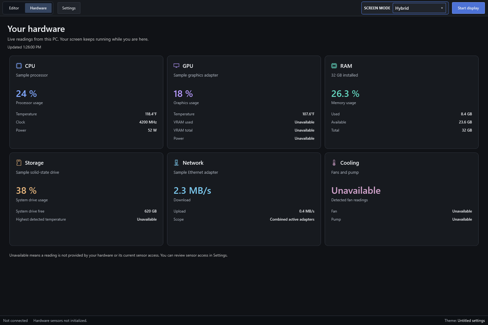

### Info Screen editor

Add widgets and manage layers on the left, arrange them on the canvas, and search for sensors or adjust properties on the right. **Settings**, **Live view** and the screen-mode selector stay within reach in the top bar.

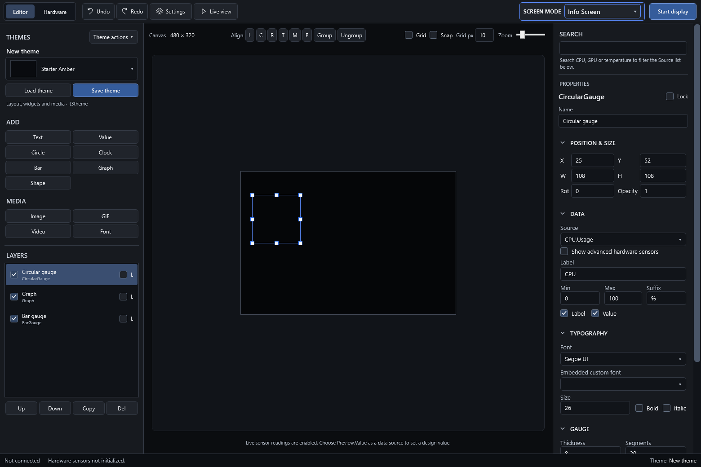

### Photo Frame workspace

Add photo files or a folder, arrange the playlist, and set shared timing, transitions, background and captions. The left panel shows photo controls for this mode.

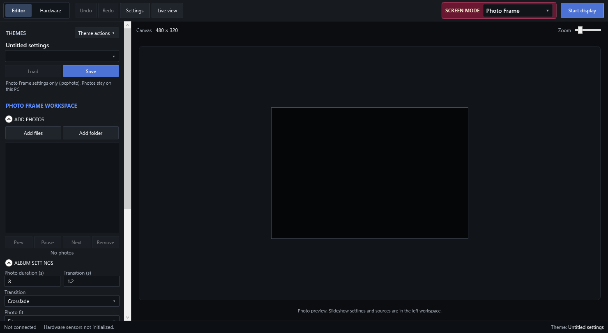

### Hybrid workspace

Combine photos with clock, weather or sensor overlays. Hybrid has its own overlay layers and settings theme; your photos stay on the PC.

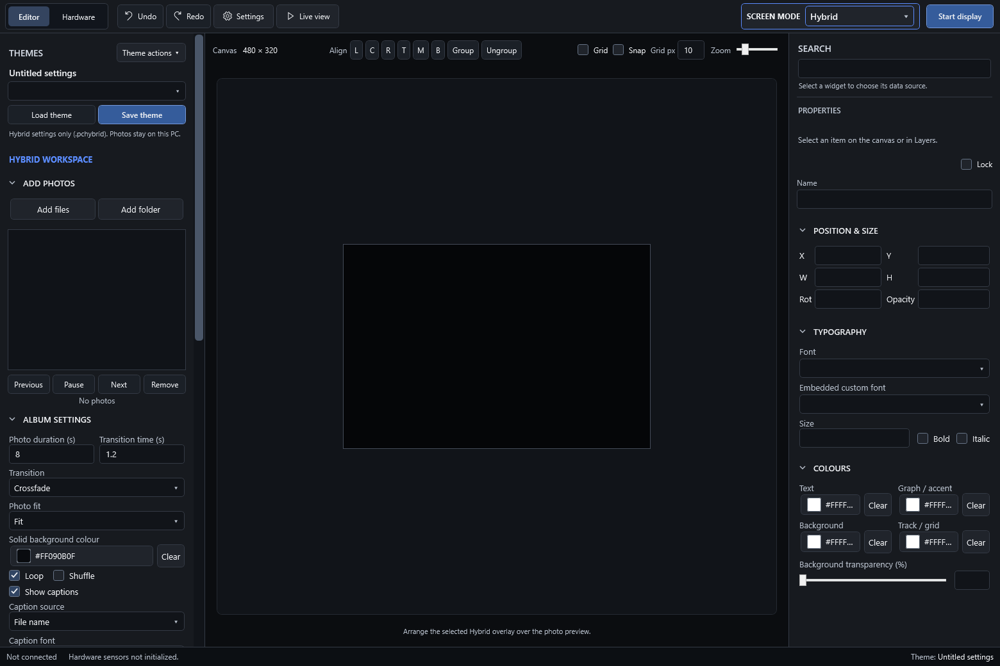

### Theme actions

Each mode has a **Themes** panel with visible **Load theme** and **Save theme** buttons. The **Theme actions** menu groups New, Open, Save as, Duplicate, Rename, Delete and Refresh, with keyboard shortcuts shown beside the main actions.

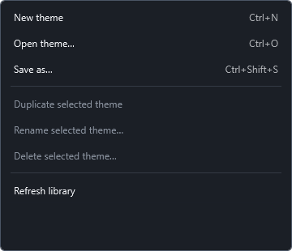

### Caption fonts, Hybrid shapes and widget backgrounds

Choose a global caption font in Photo Frame or Hybrid, add a **Shape** from Hybrid overlays, and adjust **Background transparency (%)** on any widget. The percentage affects the background fill while text, gauges, images and outlines keep their appearance.

| Caption settings | Hybrid overlays | Widget background |
| --- | --- | --- |
| 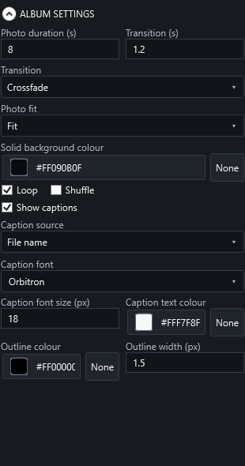 | 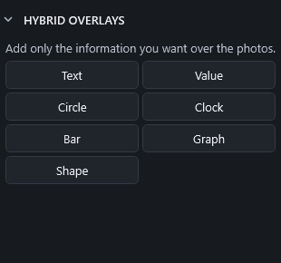 | 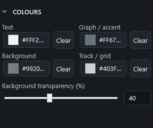 |

### Readable dark controls

Selected layers, dropdown choices, tooltips and checkboxes use explicit dark styling, with consistent spacing and visible keyboard focus. Direct Add buttons and sensor search keep their familiar positions.

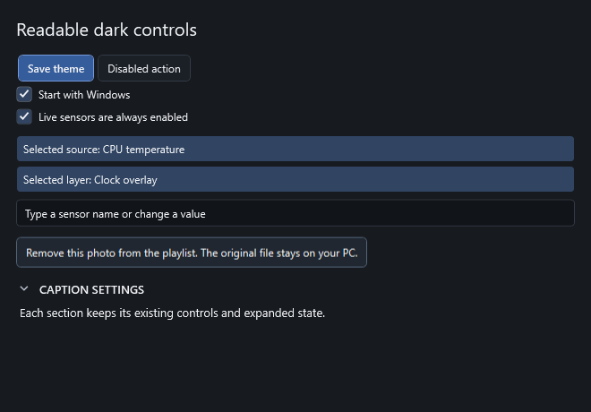

### Settings window

Open **Settings** from the top bar to manage screen connection, runtime, sensor access and editor preferences. Hardware and Settings pages use an almost-black charcoal `#101216` background with white and silver text. **Use live sensor data** stays checked because live readings are always enabled.

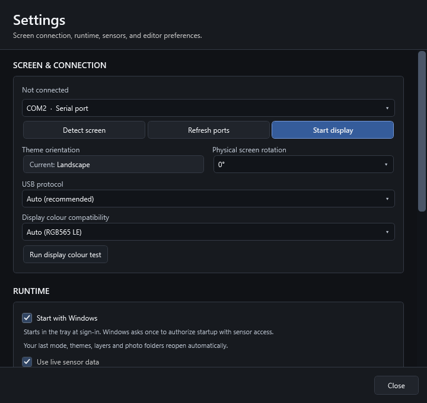

## Editor and Hardware pages

Use **Editor** to build your screen and **Hardware** to view PC hardware names and live CPU, GPU, memory, storage, network and cooling readings. Hardware is an app page; your selected Info Screen, Photo Frame or Hybrid mode and physical display output continue unchanged. Unavailable sensors are labelled clearly.

Theme actions are now in **Themes** on the left for each mode. Choose a theme and select **Load theme**, or use **Save theme** and **Theme actions** for New, Open, Save as, Duplicate, Rename, Delete and Refresh. Ctrl+N, Ctrl+O, Ctrl+S and Ctrl+Shift+S use the active mode's file format. Editor shortcuts are suspended while viewing Hardware.

Photo Frame (`.pcphoto`) and Hybrid (`.pchybrid`) themes save settings in their separate folders; photos stay on the PC. Themes remember the selected photo folder and reload its photos when opened. Themes without a folder keep the current playlist. Info Screen uses `.t3theme` files. Use **Save playlist** to save photo links separately.

## Download and run

1. Download [PCInfoScreenStudio-0.10.0-alpha.5-win-x64.zip](https://github.com/ManethonSega/PC-Info-Screen-Studio/releases/download/v0.10.0-alpha.5/PCInfoScreenStudio-0.10.0-alpha.5-win-x64.zip) from the [portable alpha release](https://github.com/ManethonSega/PC-Info-Screen-Studio/releases/tag/v0.10.0-alpha.5).
2. Extract the **entire folder** to a permanent location, then run `PCInfoScreenStudio.exe`. Keep all extracted files together.
3. Read `START-HERE.txt` for connection, startup and tray instructions. The build is self-contained; no separate .NET runtime installation is required.

The release includes [SHA256SUMS.txt](https://github.com/ManethonSega/PC-Info-Screen-Studio/releases/download/v0.10.0-alpha.5/SHA256SUMS.txt), matching source archives and `build-info.json` with the exact source commit. This is an **unsigned alpha**, with [documented device limits](docs/COMPATIBILITY.md) and [validation results and remaining checks](docs/VALIDATION.md).

For newer development builds, open the [Windows build workflow](https://github.com/ManethonSega/PC-Info-Screen-Studio/actions/workflows/build.yml), select the latest successful `main` run, then download `PCInfoScreenStudio-win-x64` under **Artifacts**. GitHub may require sign-in. These artifacts expire after **3 days**; the release download above is permanent.

## Connect your screen

1. Plug the screen into USB. Close the manufacturer's application or any other program using the same serial port.
2. In the first-run assistant, choose **Detect and connect screen**.
3. Choose **Info Screen**, **Photo Frame**, or **Hybrid**. For an Info Screen, the starter theme provides CPU, GPU, and RAM widgets.
4. Choose **Finish setup**. Use **Start display** in the top bar to connect and begin sending updates when needed.

You can finish setup without a device and edit a theme first. Use **Settings** in the top bar to select the port, detect the screen again, change orientation, or rerun the setup assistant. Stop output with **Stop display**.

The current hardware focus is 3.5-inch Revision-A USB-CDC displays, including the USB35INCHIPSV2 compatibility profile. Other sizes and revisions are not a verified compatibility promise. The app supports 480 x 320 landscape and 320 x 480 portrait layouts, plus physical rotation at 0, 90, 180, and 270 degrees.

If the port is busy or access is denied, close other screen software, including its tray process. For a sideways image or incorrect colours, check rotation and compatibility options in **Settings**; the display colour test is an optional diagnostic.

## Choose your mode

The prominent **SCREEN MODE** selector changes the left panel to show controls relevant to that mode.

| Mode | What you create | Saved theme |
| --- | --- | --- |
| Info Screen | Widgets, media, and live sensor information | `.t3theme` package in `Documents/PC Info Screen Studio/Themes` |
| Photo Frame | A photo playlist with shared slideshow and caption settings | `.pcphoto` settings in `Documents/PC Info Screen Studio/Photo Frame Themes` |
| Hybrid | Photos with a separate set of information overlays | `.pchybrid` settings and overlays in `Documents/PC Info Screen Studio/Hybrid Themes` |

Photo Frame and Hybrid themes do **not** embed photos. **Add folder** remembers the folder in the mode theme; opening that theme reloads its photos, including subfolders, whether folder watching is on or off. Hybrid themes also preserve exact overlay positions and layer settings. Themes without a saved folder keep the current playlist. Photos remain on your PC. Use **Save playlist** / **Load playlist** to store and restore photo references separately as a `.pcalbum` preset. Keep linked files available at their saved locations; these presets are not portable photo bundles. For older themes saved without a folder path, choose **Add folder** once and save the mode theme again.

### Info Screen editing

- Add **Text**, **Value**, **Circle**, **Clock**, **Bar**, **Graph**, or **Shape** directly from the left panel.
- Select the widget, then choose its **Source** on the right. **SEARCH** filters that dropdown, for example `GPU` shows GPU sources or `CPU temperature` finds the temperature source. **Clear** restores the full list. Searching does not add widgets or change the current sensor; choosing a source changes only the selected widget.
- Drag widgets on the canvas and edit their appearance and data source in the right-hand properties panel. **Background transparency (%)** runs from 0 (solid) to 100 (invisible) and affects only the widget background, preserving text, gauges, images and outlines. Widget resizing does not change its explicit font-size setting.
- Organize layers, hide or lock objects, use multi-selection and grouping, and align or distribute items. Grid snapping, smart guides, keyboard movement, undo/redo, and editor zoom are implemented.
- Add images, animated GIFs, and custom fonts. The built-in fonts include Bungee, Fredoka, Monoton, and Orbitron.
- Use **Themes > Save** or **Theme actions > Save as...** for a shareable `.t3theme` package with imported assets. The theme library supports generated thumbnails, loading, duplication, renaming, and deletion.

Live sensor data is always enabled. The checked **Use live sensor data** option in Settings is an indicator; missing sensors remain unavailable. Select `Preview.Value` as a widget data source when you want to set a manual design value.

The app opens in a larger window, automatically fitting within the monitor work area and Windows display scaling. Both side panels remain scrollable.

**Live view** hides editing controls for a clean preview. **Back to edit** returns to the editor. This is separate from starting or stopping physical display output.

### Photo Frame and Hybrid

- Under **ADD PHOTOS**, add multiple files or a folder. Save the mode theme to remember the folder for next time; use a playlist preset to preserve individually selected files or a custom order. Drag playlist entries to reorder; use previous, pause/play, next, and remove controls.
- Set a shared display duration, transition duration, loop, shuffle, and Fit/Fill/Stretch behaviour.
- Choose Crossfade, Slide, Zoom, Instant, or Random transitions **between** photos. There is no continuous pan-and-zoom animation.
- Choose a solid background colour.
- Configure captions globally: none, filename, date taken, location, or custom text. Missing date/location metadata leaves the caption blank.
- **Caption font**, **Caption font size**, text colour, outline colour, and outline width control readability. Caption font selection includes bundled fonts and fonts installed on your PC; the choice is saved in the mode theme. Set outline width to zero for no outline; there is no fixed caption highlight.
- Folder watching and playlist presets are grouped under **WATCHED FOLDER & PLAYLISTS**.
- Hybrid adds text, values, circles, clocks, bars, graphs, and shapes over the photos.

EXIF orientation is corrected when preparing photos. Per-photo crop, focal point, duration controls, blurred backgrounds, and scheduling are deliberately excluded from the current interface.

## Data sources and sensors

The app combines Windows CPU/RAM, system-drive and network readings with hardware sensors from LibreHardwareMonitor. Optional HWiNFO shared-memory sources require HWiNFO to be running and configured separately. Sensor availability depends on your hardware and permissions; unavailable readings are shown as unavailable rather than invented zeroes.

For additional low-level sensor access, open **Settings > HARDWARE SENSORS**. The portable publish includes the official, checksum-verified PawnIO prerequisite installer. Installing it is optional and requires explicit confirmation and Windows elevation. Once PawnIO is installed, **Request administrator access when the app starts** is enabled by default. For a manual launch, approve the Windows UAC prompt to initialize full sensors automatically; you do not need to inspect or reinstall the driver every time. Declining the prompt opens the app with available sensors. The approved Windows startup task supplies this account's permissions at sign-in without a repeated prompt. Disable manual-launch permission requests under **Settings > HARDWARE SENSORS** if you prefer to request access yourself.

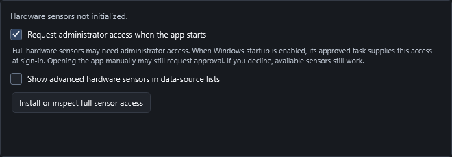

For weather, select a Weather source in the properties panel, enter a city, and choose **Update**. Open-Meteo supplies weather/geocoding; the city is a local preference and conditions refresh approximately every ten minutes.

## Lightweight runtime

**Start with Windows** and **Start display automatically with the app** are enabled by default under **Settings > RUNTIME**. On the first launch of this version, approve Windows setup once. The app adds an entry to Windows Startup Apps and uses an approved, per-user Task Scheduler task to obtain that account's available sensor permissions at sign-in. It stores no password and does not disable UAC. Full administrator sensor access requires an administrator Windows account. Manual launches can still request UAC approval.

At Windows sign-in, the app starts in the tray, restores your last mode and working theme, and reconnects the last successful display port. It briefly retries while USB devices become available. Turn off either startup or automatic display connection in Settings when you prefer to launch or connect manually. Keep the complete portable app folder in a stable location; opening a moved copy updates its startup registration after Windows approval.

Closing to the tray keeps the same session running. **Exit** saves a private resume snapshot, including Info Screen and Hybrid layers, each mode's loaded theme and photo settings, linked photos/folders, and unsaved edits. Windows logoff/restart also saves this snapshot. Opening the app again restores it automatically without overwriting any reusable theme file. Use **Save** under Theme options when you want to update that reusable theme. Linked photos stay on the PC.

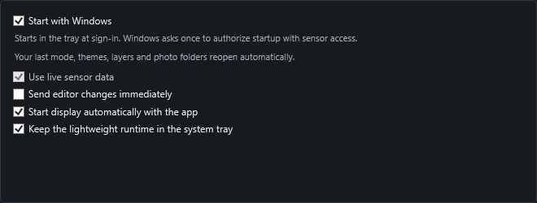

The system-tray option is in **Settings > RUNTIME**. When minimized or closed to the tray, editor-only preview work is suspended and preview resources are released while display output continues as needed. The tray menu provides mode switching and previous/pause/next photo controls.

Photo preparation uses a bounded display-sized cache. Memory usage varies with theme assets and workload; see the [roadmap](docs/ROADMAP.md) for the current owner-reported observation and remaining validation work.

## Known alpha limitations

- Device compatibility beyond the current Revision-A focus needs verification.
- **Video import currently stores an asset and displays a placeholder; video playback is not implemented.** Animated GIF playback is implemented.
- Physical animation speed depends on USB display bandwidth.
- Photo presets and linked Hybrid assets can depend on local paths.
- Successful builds and startup smoke checks do not establish long-duration hardware reliability.
- There is no signed installer or automatic updater.
- Physical-device testing and first-time user validation remain limited. See the [device catalogue](docs/COMPATIBILITY.md) and [validation record](docs/VALIDATION.md).

## Build from source

On Windows, install the .NET 10 SDK, then run:

```powershell
git clone https://github.com/ManethonSega/PC-Info-Screen-Studio.git
cd PC-Info-Screen-Studio
dotnet build src/PCInfoScreenStudio.App/PCInfoScreenStudio.App.csproj -c Release
powershell -NoProfile -ExecutionPolicy Bypass -File scripts/publish-win-x64.ps1
```

The portable output is `artifacts/win-x64`. The publish script also downloads and verifies the PawnIO prerequisite installer. Keep the complete output folder together.

## Development and feedback

See the [current roadmap](docs/ROADMAP.md) for completed work and the next polish milestone. Report problems through [GitHub Issues](https://github.com/ManethonSega/PC-Info-Screen-Studio/issues), including app version, display model, mode, steps to reproduce, and relevant screenshots. Do not upload private photos or personal paths unnecessarily.

The display driver derives from [Tedd.TuringScreen](https://github.com/tedd/Tedd.TuringScreen). Third-party licensing and attribution are in [THIRD_PARTY_NOTICES.md](THIRD_PARTY_NOTICES.md). This project is independent and is not affiliated with or endorsed by TURZX, Turing, or the display manufacturer.

## License

Copyright (c) 2026 PCInfoScreenStudio contributors.

PC Info Screen Studio is free software: you can redistribute it and/or modify it
under the terms of the GNU General Public License as published by the Free
Software Foundation, either version 3 of the License, or (at your option) any
later version (`GPL-3.0-or-later`).

It is distributed without any warranty. See [`LICENSE`](LICENSE) for the full
terms. When distributing an executable or modified version, provide its
corresponding source, including the build scripts, under the applicable GPL
terms. Source downloads must correspond to the exact distributed build.

Third-party code, libraries, fonts and the separate PawnIO prerequisite retain
their own copyright notices and licenses. See
[`THIRD_PARTY_NOTICES.md`](THIRD_PARTY_NOTICES.md) and component-specific notices.
The GPL does not automatically apply to users' photos or independently created
theme assets.

Versions supplied under MIT before this license change keep their previously
granted rights. This change does not withdraw those rights.
