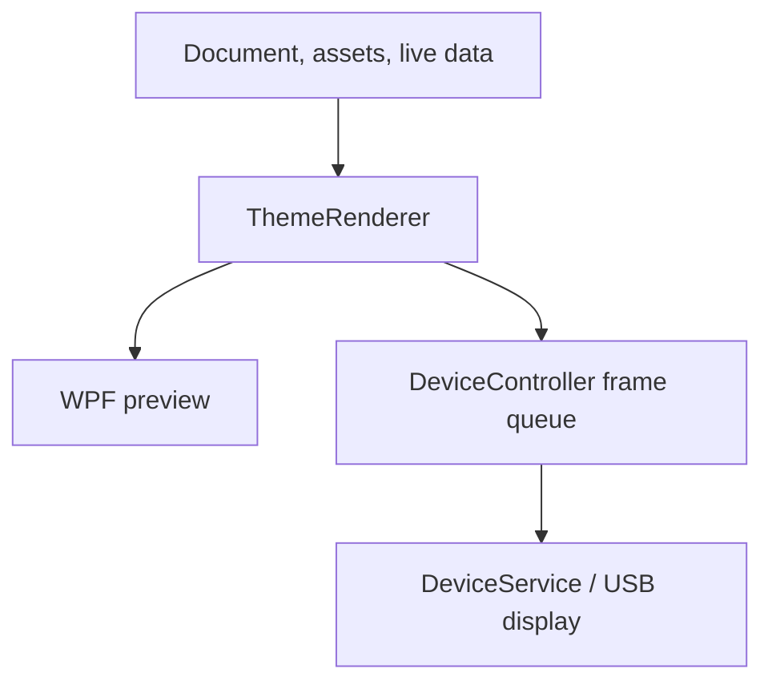

# Architecture

## Responsibility boundaries

The first gradual refactoring pass keeps the existing WPF binding surface while moving operational state into independent controllers. None of the controllers depends on MainViewModel.

| Component | Owns | Collaborators |
| --- | --- | --- |
| `MainViewModel` | Existing commands/binding names and cross-feature coordination | Controllers, current workspace, theme/data services |
| `DeviceController` | Port discovery, connection state, diagnostics, compatibility, and latest-frame send queue | `IDisplayDevice`, settings, current-document accessor |
| `PhotoPlaybackController` | Linked playlist, selected photo, timing, transitions, navigation, preloading, and folder watcher | Settings, current-workspace accessor, album/file services |
| `EditorController` | Selection, grouping, movement, alignment guides, layers, duplication/deletion, and widget defaults | Current-document accessor |
| `SettingsController` | Loaded preferences, change notifications, and preference persistence | `AppSettingsService` |
| `DeviceService` | Serialized background device I/O and protocol integration | Vendored Tedd.TuringScreen driver |

The coordinator forwards controller property-change notifications and translates controller events into existing command-state updates, dirty/history handling, preview refresh, and frame requests. The XAML and its public binding names are unchanged.

Current workspace/document accessors are deliberately evaluated when an operation runs. Opening a theme, applying an undo snapshot, or switching mode must not leave a controller editing an old document.

## Rendering and output

The editor preview and physical screen share ThemeRenderer. The renderer produces a logical Skia bitmap; the device driver handles conversion, rotation, framebuffer differences, and transmission.



The frame queue retains only the latest waiting frame, not an unbounded animation backlog. It owns bitmap copies and releases replaced, sent, and pending-on-disposal copies. DeviceService serializes hardware I/O through its existing gate.

## Photos and lifecycle

Photo Frame and Hybrid use linked PC files with separate mode-setting presets and playlists. Settings files do not embed photos. Runtime photo progress does not mark a document dirty; playlist and editable-setting changes do.

MainViewModel owns the UI timers and editor/tray lifecycle in this pass. PhotoPlaybackController owns playback timing and folder watching. It accepts an optional clock for deterministic playback checks. DeviceController accepts an IDisplayDevice and a discovery function, so connection and queue behaviour can be checked without USB hardware.

Controller subscriptions are explicitly removed during disposal. The photo watcher and pending device frames are released by their owning controller. The current workspace continues to own its extracted temporary assets.

## Preferences and compatibility

AppSettingsService preserves the existing settings JSON and migrations. Its optional settings-file path lets checks use an isolated temporary profile, not a user's real preferences. SettingsController does not know about widgets, sensors, or the USB protocol implementation.

Theme serialization, file extensions, mode folders, imported assets, UI labels, and renderer logic are unchanged by the refactor.

## Automated workflow checks

`tests/PCInfoScreenStudio.ControllerChecks` is a dependency-free Windows console check harness. CI builds it and runs it before publishing.

It checks preference persistence/notifications, editor selection/grouping/locking, grid movement, duplication/deletion, alignment guides, Hybrid isolation, current-document replacement, slideshow timing/pause/reorder/end-of-playlist behaviour, connection-state forwarding, and latest-frame queue replacement. The USB boundary uses a fake device; these checks do not prove physical-device compatibility or long-duration reliability.

On Windows with the .NET 10 SDK:

```powershell
dotnet run --project tests/PCInfoScreenStudio.ControllerChecks/PCInfoScreenStudio.ControllerChecks.csproj -c Release
```

## Remaining gradual work

MainViewModel is reduced from 3,043 lines to approximately 2,062 lines. Theme-library orchestration, live metric coordination, undo snapshot application, and recovery still remain there. Future passes should extract those separately, preserving the current user workflow rather than redesigning the UI during a structural change.

## Projects and licensing

PCInfoScreenStudio.App contains the WPF UI, controllers, models, services, and shared renderer. Tedd.TuringScreen is the vendored MIT-licensed hardware layer; the application is GPL-3.0-or-later. See the root license and third-party notices.
